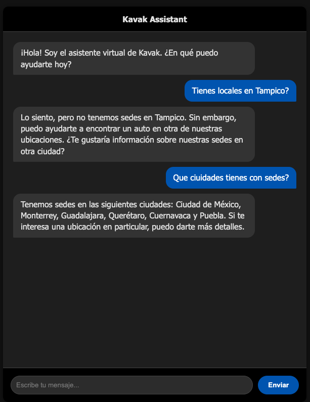
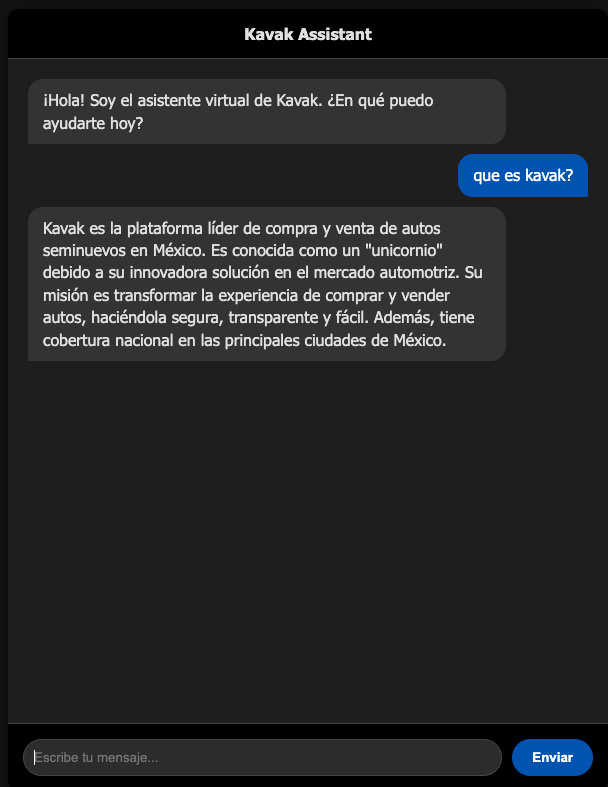
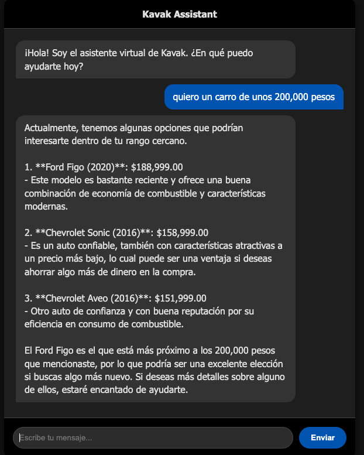

# Kavak Chatbot - Prueba Técnica

Este proyecto es una prueba técnica para la posición de AI Engineer en Kavak. Consiste en un chatbot inteligente capaz de responder preguntas frecuentes (RAG), buscar autos en un catálogo simulado y calcular opciones de financiamiento, todo orquestado mediante un grafo de decisiones stateless.

## Instalación y Ejecución Local

Para ejecutar el proyecto localmente, asegúrate de tener Python 3.11+ instalado:

```bash
# 1. Crear entorno virtual
python3 -m venv venv
source venv/bin/activate

# 2. Instalar dependencias
pip install -r requirements.txt

# 3. Configurar variables de entorno
# Crea un archivo .env basado en settings.py o exporta tus variables (OPENAI_API_KEY)

# 4. Ejecutar servidor
uvicorn main:app --reload
```

## Demo Online

El servicio cuenta con una interfaz de chat web disponible para pruebas en:
👉 **[https://kavaktest.nomada.dev/](https://kavaktest.nomada.dev/)**

## Integración con Twilio
Para probar la integración con WhatsApp (Twilio Sandbox):
1.  Envía `join start-listen` al número **+1 415 523 8886**.
2.  O usa este link directo: [https://wa.me/14155238886?text=join%20start-listen](https://wa.me/14155238886?text=join%20start-listen)

### Comandos Especiales
- **`/reset`**: Borra el historial de conversación de tu número. Útil para pruebas cuando quieres empezar una nueva conversación sin contexto anterior.

---

## Decisiones Técnicas

### RAG: Router Semántico + Recuperación vs. Búsqueda Vectorial Simple

En lugar de utilizar una búsqueda vectorial simple (RAG tradicional) donde se busca similitud contra toda la base de conocimiento, optamos por un enfoque de **Enrutamiento Semántico**:

1.  **Clasificación**: Un LLM clasifica la intención del usuario en categorías predefinidas (e.g., `locations`, `financing`, `app_services`).
2.  **Recuperación Dirigida**: Se recupera únicamente el documento maestro correspondiente a esa categoría.

**¿Por qué?**
La búsqueda vectorial simple tiende a "alucinar" o traer contextos irrelevantes cuando la pregunta no tiene una similitud semántica fuerte con la respuesta correcta (e.g., preguntar por una ciudad que no existe en la lista de sedes). El enrutamiento hace la respuesta más **predecible y controlada**: si el router clasifica como `locations` y la ciudad no está en el documento, el modelo puede responder con certeza que no tenemos sede ahí, en lugar de intentar adivinar basándose en palabras clave de otros documentos.

### Arquitectura "Stateless Graph"
En lugar de utilizar LangGraph como una máquina de estados persistente (donde el usuario "navega" entre nodos y el estado se guarda en `Checkpoints`), optamos por un enfoque donde **el grafo se ejecuta de principio a fin en cada petición**.

**Ventajas:**
- **Simplicidad**: No necesitamos gestionar persistencia compleja de grafos ni migraciones de estado si cambiamos la lógica.
- **Robustez**: El estado se reconstruye en cada turno basándose en el historial de chat crudo.
- **Flexibilidad**: El router evalúa la intención con todo el contexto actualizado en cada interacción.

📖 **Ver detalles técnicos en:** [`specs/GRAPH_README.md`](specs/GRAPH_README.md)

### Resolución de Contexto (Financiamiento)
Para calcular financiamiento sin guardar estado, implementamos el nodo `resolve_car_context`. Este nodo analiza el historial de la conversación con un LLM para identificar cuál fue el último auto mencionado (por el usuario o el bot) y extrae sus datos (Marca, Modelo, Precio).

*Nota: No es una solución infalible (depende de la ventana de contexto y la precisión del modelo), pero para el objetivo de esta prueba técnica funciona de manera excelente y evita la complejidad de una base de datos de sesiones.*

### Diagrama de Flujo
```ascii
                            [ START ]
                                |
                                v
                     +----------------------+
                     |   detect_intention   |
                     | (Router Classifier)  |
                     +----------------------+
                                |
          +---------------------+---------------------+---------------------+
          |                     |                     |                     |
          v                     v                     v                     v
   [ intent="faq" ]      [ intent="buy" ]    [ intent="financing" ]  [ intent="general" ]
          |                     |                     |                     |
          v                     v                     v                     v
 +------------------+  +------------------+  +-------------------+  +------------------+
 |    handle_faq    |  | reason_about_car |  |resolve_car_context|  |  handle_general  |
 | (RAG Retrieval)  |  | (Extract & Find) |  | (History Analysis)|  | (Chitchat/Help)  |
 +------------------+  +------------------+  +-------------------+  +------------------+
          |                     |                     |                     |
          |                     v                     v                     |
          |            +------------------+  +------------------+           |
          |            |respond_with_options|| handle_financing |           |
          |            | (Format Results) |  | (Calc Payments)  |           |
          |            +------------------+  +------------------+           |
          |                     |                     |                     |
          +---------------------+---------------------+---------------------+
                                |
                                v
                             [ END ]
```

## Base de Datos

📖 **Documentación completa en:** [`specs/DB_README.md`](specs/DB_README.md)

La aplicación usa **SQLite** con autocarga de datos:
- **Catálogo de autos**: Cargado desde `specs/sample_caso_ai_engineer.csv`
- **Documentos RAG**: Generados con embeddings de OpenAI en startup

⚠️ **Nota**: La BD se auto-crea por practicidad en esta prueba técnica. En producción real, la inicialización de datos debería ser manejada por migraciones (Alembic) y scripts separados de la lógica de la aplicación.

## Notas para Revisión

- **Ventana de contexto**: El historial de chat está limitado a las últimas 24 horas para evitar contexto obsoleto. Esto es configurable en `utils.get_chat_history()`.
- **Fuzzy Matching**: El catálogo usa `thefuzz` para búsquedas flexibles (ej: "Jeta" → "Jetta"). Umbral configurado en 70 puntos.

## Screenshots
### RAG
<table>
  <tr>
    <td></td>
    <td></td>
    <td></td>
  </tr>
</table>

### Compra de Carro
<table>
  <tr>
    <td></td>
    <td></td>
  </tr>
</table>

### Infraestructura
El despliegue se realiza con Kubernetes para aprovechar un servidor propio donde alojo mis proyectos UwU.
